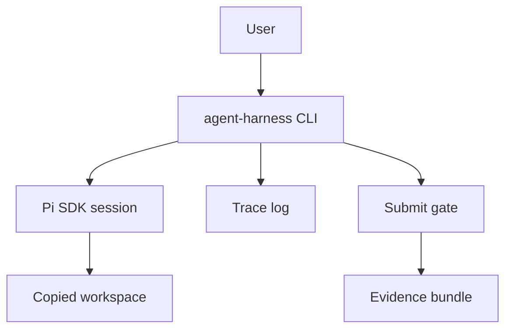

# Pi Interactive Harness Experiment Plan

## Goal

Test whether Pi can be used as the runtime behind a local interactive harness
where:

```text
user logs into Pi with an account/provider of choice
-> user works through the harness on a codebase
-> harness sends prompts to Pi SDK
-> Pi helps inspect or modify the codebase
-> harness records Q/A and code-change trace
-> user runs submit
-> submit runs a simple quality gate
-> harness writes an evidence bundle
```

The claim being tested is not learning, grading, AI-proof authorship, or
independent transfer. The claim is:

```text
Can a local harness mediate interactive agent work and own the trace plus submit gate?
```

## Non-Goals

- teacher dashboard
- grading
- concept-transfer proof
- cheating prevention
- multi-user classroom flow
- perfect provenance
- universal provider support
- polished UI
- LLM-based quality judgement as the first gate

## Experiment Shape

Build a small CLI around the Pi SDK:

```bash
agent-harness interactive-pi ./examples/small-codebase
```

The user interacts with the harness, not directly with Pi. The harness forwards
prompts to Pi and records the interaction.

Example session:

```text
> ask What does this code do?
> ask Find one quality issue.
> ask Apply the smallest fix.
> submit
> exit
```

## Architecture



Plain version:

```text
The harness prepares a safe workspace copy, opens a Pi SDK session in that
workspace, forwards user prompts, captures the transcript/events/diff, and owns
the submit command.
```

## MVP Command Set

Implement only this command set first:

```text
interactive-pi <codebase>
ask <prompt>
status
submit
exit
```

Suggested behavior:

- `interactive-pi <codebase>` starts the harness and copies the codebase into
  `runs/<run-id>/workspace`.
- `ask <prompt>` sends one user prompt to Pi SDK and records the response.
- `status` prints current run id, workspace path, git status summary, and turn
  count.
- `submit` runs the submit gate and writes or updates the evidence bundle.
- `exit` ends the session without pretending the work was submitted.

## Workspace Boundary

The first implementation should not mutate the original codebase directly.

Use:

```text
runs/<run-id>/workspace
```

This keeps the experiment recoverable and makes diffs easy to inspect. A later
version can add an explicit "work in place" mode if needed.

## Trace Capture

For every `ask`, append one JSONL record:

```json
{
  "turn": 1,
  "timestamp": "2026-06-22T00:00:00.000Z",
  "userPrompt": "Find one quality issue.",
  "assistantText": "...",
  "eventsCount": 12,
  "gitStatusAfterTurn": "...",
  "diffAfterTurn": "..."
}
```

Also write a readable transcript:

```text
runs/<run-id>/trace/transcript.md
```

Do not claim the trace is user thinking. It is only interaction and work
evidence.

## Submit Gate

The first `submit` gate should stay deterministic:

```text
submit =
  collect git status
  collect git diff
  run configured check command if present
  write submit result
  write summary
```

Initial result states:

```text
ready
needs-retry
human-review-needed
blocked
```

Recommended first rule:

- `ready` when the configured check exists and passes.
- `needs-retry` when the configured check runs and fails.
- `human-review-needed` when no configured check exists but trace and diff were
  captured.
- `blocked` when Pi auth/session/workspace setup failed or evidence cannot be
  written.

Do not add an LLM quality-review skill until the deterministic submit gate
works.

## Evidence Bundle

Each run should produce:

```text
runs/<run-id>/
  input/
    codebase-path.json
    session-config.json
  workspace/
    ...
  trace/
    turns.jsonl
    transcript.md
  changes/
    final.diff
    file-status.json
  checks/
    submit-checks.json
    test-output.txt
  summary.md
```

The summary should answer:

- What runtime was used?
- Was Pi SDK available?
- Was a locally authenticated model available?
- Which workspace was used?
- How many turns happened?
- What files changed?
- What checks ran?
- What did `submit` decide?
- What evidence supports that decision?
- What human action, if any, is required?

## Core Questions

| Question | Success signal |
| --- | --- |
| Can the harness start a Pi SDK session? | Session metadata captured |
| Can the user interact through the harness? | Multiple Q/A turns logged |
| Can Pi target the workspace copy? | Reads/edits happen under `runs/<run-id>/workspace` |
| Can the harness collect trace? | `trace/turns.jsonl` and `trace/transcript.md` exist |
| Can the harness collect changes? | `changes/final.diff` and `changes/file-status.json` exist |
| Can submit be owned by the harness? | `submit` runs checks and writes summary result |
| Does auth stay local to Pi? | Harness receives no provider key or token |
| Is the trace inspectable? | Summary is useful without reading every raw event |

## Behavior Evidence Loop

The first implementation must be verified with one real or precondition-stopped
run:

```text
interactive-pi examples/small-codebase
ask Inspect the code and make the smallest safe improvement.
submit
exit
```

Expected evidence if Pi auth is available:

```text
trace/turns.jsonl has at least one user prompt and assistant response
changes/final.diff exists
checks/submit-checks.json exists
summary.md reports runtime/auth/check/change status
```

Expected evidence if Pi auth is not available:

```text
summary.md reports human action required
submit result is blocked
no fake session or fake trace is created
```

## Stop Conditions

Stop and report honestly when:

- Pi SDK has no locally authenticated model.
- Pi requires an interactive login that the agent cannot complete.
- The harness would need raw provider keys or tokens.
- The runtime cannot be constrained to the copied workspace.
- The trace is too thin to reconstruct Q/A turns.
- Submit cannot write a coherent evidence bundle.

## Main Failure Modes

- User bypasses the harness and works directly in Pi, making trace incomplete.
- The harness records a transcript but cannot prove which workspace changed.
- The submit gate becomes decorative and does not own a real decision.
- The evidence bundle is too noisy to inspect.
- The tool overclaims learning, authorship, or transfer from interaction trace.
- The first slice tries to include teacher logic, grading, or LLM review too
  early.

## Acceptance Bar

The experiment is useful if one run can show:

```text
what the user asked
what Pi answered
what files changed
what checks ran
what submit decided
what evidence supports that decision
```

That validates the core harness shape better than a one-shot prompt probe.
