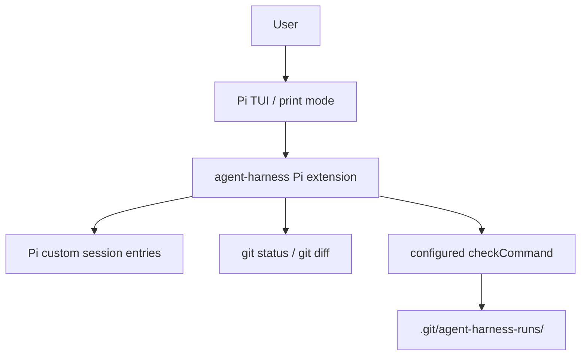

# Pi Extension Harness Pivot Plan

## Goal

Use Pi as the interactive harness and make `agent-harness` a Pi extension that
adds evidence capture and a deterministic submission gate.

The claim being tested is:

```text
Can Pi be customized so normal Pi work produces recoverable trace, diff, check,
and submit-decision evidence?
```

## Non-Goals

- separate readline prompt shell
- Pi SDK wrapper CLI
- copied workspace
- teacher dashboard
- grading
- cheating prevention
- perfect provenance
- LLM-based quality judgement as the first gate

## Current Shape

The user works directly in Pi:

```bash
pi -e /path/to/agent-harness/laboratory-class-harness/src/extension.ts
```

Inside Pi:

```text
Ask normal coding questions.
/submit
```

`agent-harness` registers Pi slash commands:

```text
/submit
/harness-status
```

## Architecture



Plain version:

```text
Pi owns the interaction. The extension observes Pi lifecycle events, stores Q/A
and diff snapshots in Pi custom session entries, and materializes an evidence
bundle when the user runs /submit.
```

## Workspace Boundary

The first pivot slice is git-bounded and works in place. It does not create a
workspace copy. Running outside a Git repository is unsupported for this slice.

Evidence is stored under Git's private path:

```text
.git/agent-harness-runs/<run-id>/
```

This keeps evidence out of `git status` and keeps the code diff focused on user
or agent changes.

## Trace Capture

For each Pi agent run, the extension stores a custom Pi session entry:

```json
{
  "runId": "2026-06-27T23-01-14-587Z",
  "cwd": "/path/to/repo",
  "turn": {
    "turn": 1,
    "timestamp": "2026-06-27T23:01:17.910Z",
    "userPrompt": "Find one quality issue.",
    "assistantText": "...",
    "gitStatusAfterTurn": "...",
    "diffAfterTurn": "..."
  }
}
```

On `/submit`, those entries are written to:

```text
trace/turns.jsonl
trace/transcript.md
```

The trace is interaction/work evidence. It is not a claim about user thinking,
authorship, or learning.

## Submit Gate

The first gate is deterministic:

```text
/submit =
  recover trace turns from Pi custom session entries
  collect git status
  collect git diff
  run .agent-harness.json checkCommand
  write evidence bundle
  return pass, reject, or blocked
```

Decision rules:

- `pass` when at least one trace turn exists and `checkCommand` exits 0.
- `reject` when at least one trace turn exists and `checkCommand` exits nonzero.
- `blocked` when there is no trace, no configured check, timeout, or evidence
  cannot be written.

The optional `.agent-harness.json` file defines the trusted local check:

```json
{
  "checkCommand": "npm test"
}
```

## Evidence Bundle

Each submitted run writes:

```text
.git/agent-harness-runs/<run-id>/
  input/
    session-config.json
  trace/
    turns.jsonl
    transcript.md
  changes/
    final.diff
    file-status.json
  checks/
    submit-checks.json
    test-output.txt
  summary.md
```

The summary answers:

- what runtime was used
- which cwd and Pi session file were used
- how many turns were traced
- what files changed according to git
- what check ran
- whether `/submit` passed, rejected, or blocked
- what evidence supports that decision

## First Slice Validation

The first slice is valid when:

```text
pi -e src/extension.ts ...
```

can prove:

- `/submit` is a real Pi slash command.
- a Pi turn is captured as Q/A trace.
- git status and diff are captured without harness artifacts polluting status.
- a passing `checkCommand` produces `pass`.
- a failing `checkCommand` produces `reject`.
- zero trace produces `blocked`.

## Stop Conditions

Stop and report honestly when:

- Pi cannot execute custom slash commands through an extension.
- Pi lifecycle events are insufficient to recover Q/A trace.
- trace cannot be persisted across process/session boundaries.
- evidence artifacts pollute the working tree status.
- `/submit` cannot write a coherent evidence bundle.
- using Pi credentials is unavailable or requires raw provider tokens.
