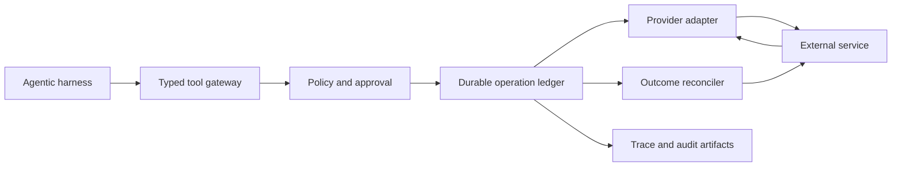

# Agent Tool Control Plane

Status: concept for a new system.

## Idea

The Agent Tool Control Plane is a deterministic layer between an agentic harness
and tools that create external side effects. It records the intended operation
before dispatch, applies policy, tracks uncertain outcomes, and reconciles
external state before allowing a retry.

Its central question is:

> How can an agent safely continue when a tool call may have succeeded, but the
> response was lost or the outcome is otherwise uncertain?

This is not mainly a prompt-engineering problem. It is a distributed-systems
problem at the boundary between a nondeterministic decision-maker and stateful
external services.

## Problem

Suppose an agent asks a tool to create an issue, post a comment, open a pull
request, send a message, or modify a cloud resource. The service commits the
operation, but the connection fails before the agent receives the response. A
naive retry can create a duplicate. Refusing to retry can leave a successful
operation unreported and later steps inconsistent.

Existing harness logs may show what the model requested, but logs alone do not
own operation identity, durable state, retry semantics, or reconciliation. The
control plane makes those responsibilities explicit.

## Proposed System

Every side-effecting tool request is converted into a typed operation with:

- a stable operation identifier;
- actor, run, and task identity;
- normalized target and parameters;
- declared preconditions and expected effects;
- policy decision and approval evidence where required;
- timestamps, attempt history, and provider responses;
- reconciliation evidence and final outcome.

The control plane persists the operation before dispatch. When the outcome is
uncertain, it queries the external system and compares observed state with the
expected effect before deciding whether retry is safe.

## Architecture



Core components are:

- typed tool gateway: validates and normalizes agent requests;
- policy layer: permits, rejects, or pauses operations for approval;
- operation ledger: durably stores state before any external side effect;
- executor adapters: translate operations into provider API calls;
- reconcilers: determine whether an uncertain effect occurred;
- evidence exporter: explains every decision, attempt, and observed outcome;
- fault injector: reproduces response loss, timeouts, and retry races for tests.

## Operation State Model

A useful initial state machine is:

```text
proposed -> rejected
proposed -> recorded -> dispatched -> confirmed
                              |          |
                              |          -> known_failed
                              -> unknown -> reconciling -> confirmed
                                                       -> safe_to_retry
                                                       -> unresolved
```

The exact states are part of the public software contract. In particular,
`unknown` must not be collapsed into `failed`: failure to receive a response is
not proof that the external operation failed.

The control plane should not promise universal exactly-once execution. It can
provide idempotency where the provider supports idempotency keys and otherwise
reduce duplicate risk through stable markers, provider queries, effect
fingerprints, and operation-specific reconciliation.

## First Bounded Version

The first version should use one reproducible external service, preferably a
local Git forge, and only three operations:

- create an issue;
- add a comment;
- open a pull request.

It should include:

- one Pi integration;
- a typed operation schema;
- a SQLite operation ledger;
- one provider adapter;
- explicit approval rules for selected operations;
- reconciliation for a response lost after server-side commit;
- a deterministic fault proxy or provider stub;
- a command that explains an operation's complete history.

This slice is deliberately small enough for the system owner to understand the
state machine, storage model, adapter, and recovery behavior end to end.

## Evaluation

The core experiment should compare a naive direct tool client with the control
plane under controlled failures. For each operation and injected failure point,
measure:

- duplicate side effects;
- successful effects incorrectly reported as failures;
- unresolved operations;
- recovery rate and time;
- retries and human interventions;
- latency and storage overhead;
- completeness of the evidence needed to explain the final state.

The most important test is response loss after commit because it creates genuine
outcome ambiguity. Additional experiments can cover timeouts before dispatch,
provider errors, process crashes, concurrent retries, and stale reconciliation
reads.

## Research and Publication Position

For SoftwareX, the contribution would be an open and reusable control-plane
implementation, typed operation contract, durable ledger, adapter interface,
reconciliation framework, fault-injection environment, and reproducible case
study. The paper should make a bounded claim: the software makes selected
agent-initiated side effects controlled, recoverable, and auditable under
specified failures.

That is stronger and more defensible than presenting it as a generic MCP proxy
or claiming that it makes agents reliable in general. A later empirical paper
could study larger operation sets, multiple providers, policy strategies, or
how often real agent sessions enter uncertain states.

## What Building It Teaches

This project teaches both agentic-system engineering and classical systems
engineering:

- tool protocols and harness integration;
- state machines and durable workflow execution;
- idempotency and retry semantics;
- database transactions and crash recovery;
- API contracts and provider adapters;
- policy and human-approval boundaries;
- observability, provenance, and audit trails;
- fault injection and reliability experiments.

The agentic part is the uncertain, model-driven caller. The core engineering
value comes from placing deterministic control around the effects that caller
can produce.

## Relationship to the Other Systems

The systems can cooperate without becoming one product:

- the current Pi harness captures interaction, diff, and submit evidence;
- the Control Plane owns lifecycle and recovery of side-effecting tool
  operations;
- AgentQual can use evidence from both when qualifying a model-harness
  configuration.

Keeping these contracts separate prevents a single research prototype from
becoming an untestable collection of logging, evaluation, policy, and execution
features.

## Non-Goals

- a universal sandbox for arbitrary shell commands;
- a general multi-agent orchestration platform;
- model selection or routing;
- long-term agent memory;
- a dashboard-first observability product;
- a universal exactly-once guarantee;
- support for every provider in the first version.
